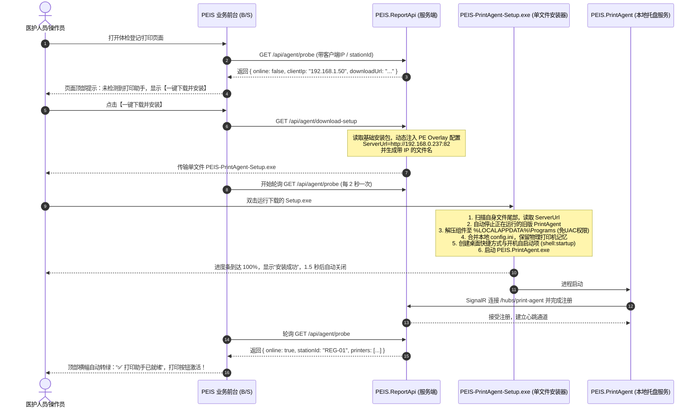

# PEIS 客户端打印助手自动检测与免解压一键安装闭环架构设计

## 一、需求背景与业务痛点

在医院体检中心、护士站、医生站的实际运行环境中，原有的客户端分发与安装存在以下三大痛点：

1. **ZIP 压缩包使用门槛高且极易出错：**
   - 医护人员计算机水平参差不齐，常常直接在 Windows 临时解压缩目录中双击运行，导致相对路径下的依赖组件（如 `SumatraPDF.exe`、`appsettings.json`、`agent.ini`）找不到或加载失败；
   - 升级时由于旧进程被占用锁定，解压覆盖经常报“文件正在使用”错误。
2. **多终端配置成本高、配置易错漏：**
   - 现场体检科往往有几十台登记台、抽血台、身高体重台、医生诊室；
   - 传统方案需要实施人员逐台打开记事本修改 `ServerUrl=http://192.168.0.237:82`，一旦输错 IP 或端口即无法连接，售后沟通成本极高。
3. **权限受限导致安装失败：**
   - 许多三甲医院采用严格的 Windows Active Directory (域) 策略，护士和医生没有本地管理员（Administrator）权限；
   - 传统安装包写入 `C:\Program Files` 会触发 UAC 提权弹窗，输入不了密码直接导致安装受阻。

---

## 二、完美闭环架构设计

本方案实现了 **“自动探针检测 -> 页面友好提示 -> 一键下载自包含 EXE -> 零配置静默部署并自启 -> 页面自动恢复就绪”** 的全自动闭环流程。



---

## 三、核心技术实现细节

### 1. 服务端配置动态注入技术 (PE Overlay + 动态文件名)
为了避免“每换一个现场或每换一个服务器 IP 就要重新编译一次安装包”，我们采用成熟的 **PE 可执行文件附加数据段 (PE Overlay)** 技术：
- **原理：** Windows PE 格式规范中，可执行文件的大小由各节（Section）的头信息决定。Windows 内核加载器在将程序载入内存时，只会映射 PE 标头声明的数据节，追加在文件末尾的多余字节（Overlay）完全不会被执行代码拦截，更不会导致程序报“格式损坏”。
- **注入格式：**
  ```text
  ###PEIS_CONFIG_BEGIN###
  ServerUrl=http://192.168.0.237:82
  StationId=REG-01
  SilentPrint=true
  PrintBackend=Spool
  ###PEIS_CONFIG_END###
  ```
- **高性能流式合并 (`SequenceStream`)：**
  下载接口使用高并发串联流，仅在流末端附带数百字节的配置文本，无需在服务器内存中重复加载整个 100MB 二进制包，零内存泄露风险。
- **双重降级容错机制：**
  - **第 1 层（优先）：** 安装器读取自身文件尾部 64KB，精准解析 `###PEIS_CONFIG_BEGIN###` 标记块；
  - **第 2 层（降级）：** 若安装文件被特殊网络审计工具剥离尾部字节，安装器从自身文件名（`PEIS-PrintAgent-Setup_192-168-0-237_82.exe`）正则反解析 IP 与端口；
  - **第 3 层（IT 调试）：** 支持命令行参数覆盖：`PEIS-PrintAgent-Setup.exe --server-url=http://...`；
  - **第 4 层（默认）：** 回退到本地默认值。

### 2. 免管理员权限（Zero UAC）安装路径
- 安装路径固定为：
  `%LOCALAPPDATA%\Programs\PEIS.PrintAgent`
  （例如：`C:\Users\张医生\AppData\Local\Programs\PEIS.PrintAgent`）
- **优势：**
  - 当前登录用户拥有完全读写权限；
  - 在任何加域、受限、访客 Windows 账户下均可一键完成安装，**无任何 UAC 拦截与密码弹窗**；
  - 微软官方应用（VS Code、Teams、OneDrive、Chrome）均采用此标准用户级路径。

### 3. 热升级防锁保护与配置保留
- **自动杀进程：** 安装前自动检测并优雅关闭/终止名为 `PEIS.PrintAgent` 的所有运行实例，彻底避免 Windows 文件锁定报错；
- **智能合并配置：** 如果客户端曾经配置过专属的打印机绑定关系或 `StationId`，安装器仅更新 `ServerUrl`，完整保留用户原有的本地个性化配置。

### 4. 开机自启与桌面图标
- 安装器通过 Windows 内置 COM 接口 (`WScript.Shell`) 自动创建：
  1. **桌面快捷方式：** `桌面\PEIS 打印助手.lnk`
  2. **开机启动快捷方式：** `%APPDATA%\Microsoft\Windows\Start Menu\Programs\Startup\PEIS 打印助手.lnk`
- 电脑开机后无需医护人员手动开启，打印助手自动常驻后台系统托盘。

---

## 四、前端快速接入指南

### 1. 引用公共脚本
在业务前端页面的 `<head>` 中引入：
```html
<script src="/agent-detector.js"></script>
```

### 2. 挂载状态横幅
在表单或页面上方留出一个占位容器：
```html
<div id="agentStatusBanner"></div>

<script>
  const banner = PeisAgentDetector.mountBanner('#agentStatusBanner', {
    stationId: () => document.querySelector('#stationId').value,
    interval: 3000,
    onStatusChange(state) {
      document.querySelector('#btnPrint').disabled = !state.online;
    }
  });
</script>
```

### 3. 直接通过 API 查询状态
```javascript
const status = await PeisAgentDetector.probe({ stationId: 'REG-01' });
if (status.online) {
  console.log("打印机可用列表:", status.printers);
} else {
  console.warn("打印助手离线，下载地址:", status.downloadUrl);
}
```

---

## 五、接口定义规范

### 1. 探针检测接口
- **URL:** `GET /api/agent/probe` 或 `GET /api/agent/status`
- **入参:**
  - `stationId` (可选)：指定工作站标识
  - `clientIp` (可选)：强制指定客户端 IP（未传则自动从 `X-Forwarded-For` 或 `RemoteIpAddress` 提取）
- **返回示例:**
  ```json
  {
    "online": true,
    "clientIp": "192.168.0.88",
    "stationId": "REG-01",
    "agentId": "5fa23bc612de432f91b72e0129bc781a",
    "machineName": "DESKTOP-NURSE01",
    "version": "1.0.0",
    "lastSeenAt": "2026-09-24T12:00:00Z",
    "printers": [
      { "name": "HP LaserJet MFP M428", "isDefault": true, "driverName": "HP PCL-6" },
      { "name": "Zebra ZD888 Barcode", "isDefault": false, "driverName": "ZDesigner" }
    ],
    "printerBindings": { "A4_GUIDE": "HP LaserJet MFP M428", "BARCODE": "Zebra ZD888 Barcode" },
    "serverUrl": "http://192.168.0.237:82",
    "downloadUrl": "http://192.168.0.237:82/api/agent/download-setup",
    "message": "打印助手已在线"
  }
  ```

### 2. 安装包下载接口
- **URL:** `GET /api/agent/download-setup`
- **入参:**
  - `serverUrl` (可选)：自定义服务端连接地址（默认自动根据当前 Host 拼接）
  - `stationId` (可选)：预设工作站编码
  - `silentPrint` (可选)：预设静默打印开关（`true`/`false`）
  - `printBackend` (可选)：预设后端类型（`Spool`/`WinPrint`/`Shell`）
- **响应头:**
  - `Content-Type: application/vnd.microsoft.portable-executable`
  - `Content-Disposition: attachment; filename="PEIS-PrintAgent-Setup_192-168-0-237_82.exe"`
- **响应体:** 二进制安装文件（含尾部动态附加配置）。
