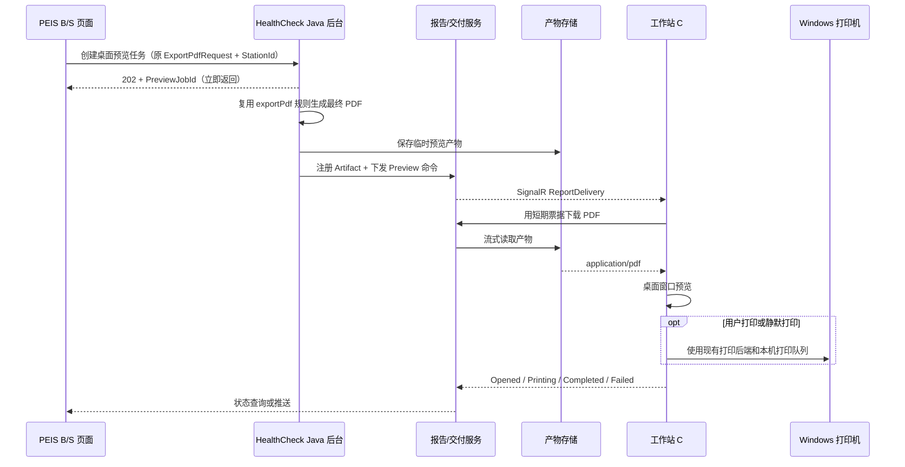

# 桌面端 PDF 预览与打印兼容方案

## 结论

可以调用工作站上的 C# 程序显示 PDF 并打印，但 **PDF 仍应由后台统一生成**。推荐采用“后台生成最终 PDF、短期产物存储、SignalR 定向下发、C# 下载后预览/打印”的混合方案。

现有浏览器导出接口保持原样；新增桌面交付接口和消息类型。桌面程序离线、版本过低或下载失败时，B/S 页面回退到原来的浏览器 PDF 下载/预览。这样无需一次性替换现有流程，也不会把模板、数据库连接、FastReport/JMReport 规则复制到每台电脑。

## 从现有 `exportPdf` 得出的边界

分析目标为 `E:\lkProject\HealthCheckHv3.0_20260616`。用户给出的两级路径 `E:\lkProject\HealthCheckHv3.0\_20260616` 在当前机器上不存在，唯一匹配目录是前者。

`PdfupdateUtil.exportPdf` 当前承担的职责远多于“输出 PDF”：

- 读取模板配置并选择 JMReport 或 FastReport（`PdfupdateUtil.java:594-603, 698-702`）。
- 个检场景先复用已生成报告 URL，再补齐未生成部分（`PdfupdateUtil.java:615-697`）。
- 按业务条件生成主报告、明细、检查检验和体检须知，并按固定顺序合并（`PdfupdateUtil.java:712-826`）。
- 添加页眉页脚、问卷/健康警示灯，并为双面打印补空白页（`PdfupdateUtil.java:823-889`）。
- FastReport 分支拼装当前兼容接口所需 JSON，然后调用配置的 `fastReportUrl`（`PdfupdateUtil.java:1190-1241`）。
- `/exportPdf` 目前同步把最终合并流写给浏览器，并记录打印次数（`ExportTemplateController.java:839-869`）。
- 报告提交时还有一条正式生成、落盘并回写 `bgurl` 的流程（`ExportTemplateController.java:574-591`）。

因此，C# 程序不应再次查询业务库、选择模板或生成报告。否则同一人可能在浏览器、桌面预览、后台正式报告中得到不同的页序、页眉页脚或双面页。

## 推荐架构



### 后台职责

1. Java 后台保留 `exportPdf` 的模板选择、已生成报告复用、合并、页眉页脚和双面页规则。
2. 建议从 `exportPdf` 抽出一个共同的 `buildFinalPdf(request)` 服务：
   - 旧 `/exportPdf` 适配器把结果流写回浏览器；
   - 新预览任务适配器把结果写入临时产物存储；
   - 原正式报告提交流程继续保存并回写 `bgurl`。
3. 第一阶段为降低改动风险，可以不立即重构整个方法，只新增一个包装器：调用现有 `exportPdf`，合并一次并写入临时文件。稳定后再把返回类型从可变的 `PDFMergerUtility` 改为明确的 `GeneratedPdf`/文件句柄。
4. 正式报告和预览报告使用同一生成核心，但生命周期分开。预览默认不能直接当作正式报告，除非数据版本、模板版本、水印配置和报告状态都已锁定并完全一致。

### C# 工作站程序职责

现有 `PEIS.PrintAgent` 已经具备以下可复用能力：

- SignalR 长连接、重连、注册和心跳；
- 通过 ArtifactId 下载 PDF，使用临时文件避免半文件进入缓存；
- 同一物理打印机串行、不同打印机并行；
- `CommandPrintBackend` 可接医院批准的静默打印程序；
- 工作目录过期文件清理。

建议新增一个 WPF 托盘外壳 `PEIS.WorkstationAgent`，把连接、下载、打印代码提取到可复用 Core 项目，而不是让 Java/浏览器直接启动任意 EXE。

C# 程序新增三种动作：

| 动作 | 行为 |
|---|---|
| `Preview` | 下载并打开桌面预览窗口，不自动打印。 |
| `Print` | 下载后直接进入现有本机打印队列。 |
| `PreviewAndPrint` | 先预览，用户确认后通过现有打印后端打印。 |

预览首选 WebView2 内置 PDF 查看能力；它适合缩放、翻页和普通打印交互。静默打印仍走现有 `IPrintBackend`，不要依赖浏览器打印对话框。若现场系统无法保证 WebView2 Runtime，再增加 PDFium 查看器作为离线备选，而不是一开始同时维护两套预览引擎。

## 为什么不以“网页直接调用 EXE/localhost”为主

| 方案 | 结论 | 原因 |
|---|---|---|
| `file://`、共享盘路径直接传给 EXE | 不采用 | 暴露服务端路径，权限和文件锁难管理。 |
| B/S 把 PDF/Base64 POST 给 localhost | 不采用 | 多一次浏览器内存复制，还会遇到 CORS、HTTPS 混合内容和本地端口冲突。 |
| 自定义协议 `peis-report://...` 承载下载地址 | 只作唤醒备选 | 协议参数容易泄露，浏览器无法可靠获得处理结果。协议中只能放无敏感信息的一次性 nonce。 |
| 后台通过 SignalR 下发 ArtifactId | **主方案** | 与现有 PrintAgent 一致，可鉴权、可回执、可追踪、可离线判断。 |

工作站程序应在用户登录后自动运行。若必须支持“程序未启动时点击预览”，可注册 `peis-report://wake?nonce=...` 仅用于唤醒程序；程序启动后仍通过 SignalR 获取真正任务，URI 中不放人员 ID、PDF URL、数据库参数或长期 Token。

## 兼容接口设计

### 保持不变

- Java `GET /exportPdf` 和 `/exportPdfByBglx`：继续返回 PDF，旧页面零改动。
- 当前 `.NET` 兼容接口 `POST /BaseInfo/Report/GetReportByJson`：继续返回 PDF，供 Java FastReport 分支和已有调用方使用。
- 现有 `POST /api/print/actions`：继续用于直接打印。
- 原正式报告提交、落盘、`bgurl` 回写逻辑保持不变。

### 新增，不改变旧接口语义

建议 Java 新增：

```http
POST /api/report-previews
Content-Type: application/json

{
  "stationId": "REG-01",
  "deliveryMode": "Preview",
  "idempotencyKey": "preview:<business-id>:<version>",
  "report": { /* 原 ExportPdfRequest 字段 */ }
}
```

立即返回：

```json
{
  "previewJobId": "...",
  "status": "Queued",
  "statusUrl": "/api/report-previews/...",
  "fallbackUrl": "/exportPdf?..."
}
```

报告交付服务向 C# 发送的新契约建议为：

```json
{
  "jobId": "...",
  "action": "Preview",
  "artifactId": "...",
  "downloadPath": "/api/report-artifacts/...",
  "fileName": "123456.pdf",
  "sha256": "...",
  "length": 1370000,
  "expiresAt": "...",
  "printerRole": null,
  "copies": 1,
  "duplex": false
}
```

状态至少包含：`Queued`、`Generating`、`Ready`、`Downloading`、`Opened`、`Printing`、`Completed`、`Failed`、`Expired`。B/S 可以轮询状态，也可以后续增加面向浏览器的 SignalR/SSE 推送。

## “预览在库里”的存储建议

如果“在库里”指需要有记录，推荐 **数据库存元数据，PDF 存文件/NAS/对象存储**。PDF 本身已经压缩，把每个临时预览放进业务数据库 BLOB 会增加备份、日志、主从同步和清理成本。

建议最少三张表：

```text
report_preview_job
- job_id, business_key, request_hash, station_id, operator_id
- status, error_code, created_at, ready_at, opened_at, expires_at

report_artifact
- artifact_id, storage_key, file_name, content_type
- sha256, byte_length, source_version, created_at, expires_at

report_delivery_target
- job_id, agent_id, action, printer_role
- status, attempt_count, last_error, completed_at
```

若医院制度明确要求 PDF 二进制必须入库，应使用独立 Artifact 库/表并设置 TTL，不要放到核心体检业务表。预览建议 30 分钟到 2 小时自动过期；正式报告继续按原有保留规则保存。

当前 `LocalPdfArtifactStore` 只写本机 `.runtime/pdf-artifacts` 且没有元数据、授权和过期清理，适合联调，不适合多实例正式环境。正式部署应替换为共享存储实现，下载接口使用短期、工作站绑定的票据。

## 安全和一致性要求

- Agent 使用安装实例 GUID 和独立注册凭据；同一 StationId 冲突必须拒绝或告警。
- Artifact 下载票据只允许指定 Agent/Station，在短时间内有效；下载接口校验 `application/pdf`、长度、SHA-256 和 `%PDF-` 文件头。
- C# 程序只允许访问配置的报告服务域名，不能执行下发的任意 EXE、命令或本地路径。
- 本地缓存使用当前 Windows 用户 ACL，预览关闭或 TTL 到期后清理。
- 任务、打开、打印、失败和重试都留审计记录，但日志不打印请求中的人员数据和完整下载 Token。
- `idempotencyKey` 防止浏览器重试导致重复生成或重复打印。

## 对 52 秒问题的真实影响

桌面预览能让 B/S 请求立即返回任务号，并显示“正在生成”，因此不会让页面挂住 52 秒；但它不会自动缩短 `exportPdf` 或 FastReport 的实际生成时间。

生成性能需要单独优化，而且仍在后台完成：

1. 相同请求在短 TTL 内、数据和模板版本一致时复用预览 Artifact，避免重复点击再次生成。
2. `exportPdf` 中每次循环创建 `RestTemplate`（`PdfupdateUtil.java:772`），应改为注入的连接池客户端并配置连接/响应超时。
3. 医院信息在循环内重复查询（`PdfupdateUtil.java:718`），同一请求可移到循环外。
4. 主报告、明细、检查检验、体检须知目前顺序远程生成；确认数据源互不依赖后，可有限并发生成，最终仍按原顺序合并。
5. 减少 `byte[] -> ByteArrayInputStream -> ByteArrayOutputStream` 的重复整包复制，大报告改用临时文件/流式产物。
6. .NET 报告服务继续优化定义缓存、图片超时/缓存和查询阶段；1.31 MB 传输本身通常不是 52 秒的主要工作阶段，必须以现有分阶段指标定位。

## 分阶段落地

### 第一阶段：最小风险试点

1. 保留所有旧接口和 Java 正式报告流程。
2. 给现有 PrintAgent 增加 `Preview` 消息与 WPF 预览窗口。
3. Java 新增异步预览包装接口，用当前 `exportPdf` 生成一次最终临时 PDF。
4. 复用现有 Artifact 下载和打印队列，先在一台工作站验证预览、确认打印和离线回退。

### 第二阶段：正式可运维

1. 任务、Agent、Artifact 元数据持久化。
2. 共享 Artifact 存储、短期下载票据、TTL 清理和审计。
3. 登录后自动启动的托盘安装包、版本管理和管理页面。
4. 浏览器展示生成/下载/打开/打印状态。

### 第三阶段：性能与复用

1. 将 `exportPdf` 重构为单一 `buildFinalPdf` 核心，避免不同入口复制生成代码。
2. 按请求哈希 + 数据版本 + 模板版本安全复用预览产物。
3. 优化并行生成、连接复用、流式合并和重型报告并发限制。

## 验收条件

- 不安装 Agent 的电脑仍能使用原浏览器导出。
- Agent 在线时，B/S 能立即得到任务号，最终由指定 StationId 的电脑打开 PDF。
- C# 预览的 PDF SHA-256 与后台生成产物完全一致。
- 预览确认打印、直接打印、双面打印和多打印机队列均有明确回执。
- Agent 离线、重连、重复点击、下载中断、打印失败不会造成无提示或重复打印。
- 正式保存的报告仍走原流程；预览过期不会删除正式报告。

