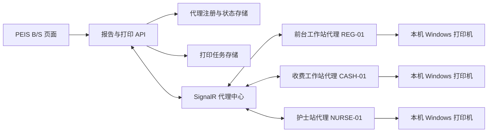

# PrintAgent 多工作站部署与管理方案

## 结论

当前 PrintAgent 的 SignalR 长连接、自动重连、心跳、按 `AgentId` 分组下发以及本机打印队列机制，已经具备**多台不同工作站同时连接**的基础。然而，它目前仍是联调形态：现场人员需要手动开命令行窗口；`AgentId` 默认取机器名；`StationId` 重复时服务端选取最近心跳的代理；代理注册和打印任务状态均保存在 API 进程内存中。因此它不适合作为多工作站的正式运行方式。

正式方案应把桌面端定位为“受管 Windows 工作站代理”，而不是让用户手工启动的命令行程序。

## 目标架构

每一台工作站只运行一个代理实例。B/S 不直接访问桌面或物理打印机，而是提交业务动作、目标站点和幂等键。API 根据目标站点、逻辑打印机角色和在线能力选择唯一代理，并通过 SignalR 下发任务。

## 正式运行模式

| 项目 | 当前联调形态 | 多工作站正式形态 |
|---|---|---|
| 启动方式 | 双击 `.cmd`，保留命令行窗口 | 安装包注册“登录后自动启动”计划任务；后台运行，无窗口。 |
| 身份 | 默认机器名，可手工填写 | 首次安装生成并永久保存 GUID `AgentId`；由管理员分配唯一 `StationId`。 |
| 配置 | 每台机器手工编辑 JSON | 安装时输入一次激活码/站点码；从服务端拉取受控配置，或由运维工具批量下发。 |
| 物理打印机 | JSON 中手工填名称 | 受管的逻辑角色映射，例如 `A4_GUIDE`、`BARCODE`、`RECEIPT`。 |
| 可见性 | 看命令行日志 | 管理页显示在线/离线、版本、最后心跳、绑定打印机、队列长度和最近错误。 |
| 任务状态 | API 进程内存 | 持久化任务、目标状态、失败原因与重试记录。 |

## 身份与路由规则

1. `AgentId` 是安装实例唯一标识，使用随机 GUID，保存在 `%ProgramData%\PEIS\PrintAgent\agent.json`。它不能依赖机器名，避免重装、克隆系统或改名造成冲突。
2. `StationId` 是业务路由标识，例如 `REG-01`、`CASH-02`。每个活动站点默认只允许一个在线代理；若同站点重复注册，服务端应明确拒绝新代理或将站点标记为冲突，不能像当前实现一样“最近心跳胜出”。
3. `PrinterBindings` 只允许“逻辑角色 → 本机打印机”映射，B/S 请求不得传任意物理打印机名称。
4. 每个打印动作必须带 `stationId` 与不可重复的 `idempotencyKey`；服务端将选中的 `agentId`、打印机角色、文档版本和状态完整记录。
5. 同一站点需要主备时，新增显式优先级和故障切换策略，不能通过重复 `StationId` 隐式负载均衡。

## 自动启动建议

优先使用 **Windows 计划任务（用户登录时启动）**，运行在实际使用打印机的工作站账户下并设置失败后重启。许多现场打印机是按用户安装的，直接作为 `LocalSystem` Windows Service 运行可能看不到该用户的打印机，因此不建议第一阶段改为纯 Windows Service。

后续可增加托盘程序：默认隐藏，状态异常时显示红色图标；允许经管理员授权执行“重新注册”“刷新打印机”“查看最近任务”“导出诊断包”。普通操作员不需要打开命令行。

## 服务端改造优先级

| 优先级 | 改造项 | 原因 |
|---|---|---|
| P0 | 稳定 GUID `AgentId` 与站点重复注册拒绝 | 防止任务被投递到错误电脑，是多机上线前置条件。 |
| P0 | 代理注册鉴权 | 每台代理使用独立安装令牌或机器证书，避免任意客户端伪造工作站。 |
| P0 | 打印任务与代理状态持久化 | 当前 `AgentRegistry`、`PrintJobStateStore` 都是进程内内存，API 重启后状态丢失。 |
| P1 | 代理健康与管理 API/UI | 快速发现离线、无打印机、版本过旧、队列阻塞和失败任务。 |
| P1 | 安装包、自动启动和静默升级 | 降低多台电脑的现场运维成本。 |
| P1 | 幂等、租约与断线重投 | 防止网络抖动时重复打印或任务永远卡住。 |
| P2 | 多 API 实例支持 | 使用共享任务存储与 SignalR backplane，面向高可用部署。 |

## 现场上线步骤

1. 在服务器部署 API、数据库状态存储与代理管理端点，配置 HTTPS。
2. 为每个工作站建立站点记录，明确站点码和逻辑打印机角色。
3. 在一台试点机器安装代理，选择当前 Windows 登录账户的计划任务自动启动方式，完成打印机绑定和演练打印。
4. 在管理端确认代理在线、打印机能力正确、下载与回执正常后，再批量安装其他站点。
5. 对每个站点分别演练 A4、条码和失败重试；确认同一任务不会重复打印。
6. 通过版本、心跳、错误告警和任务审计进行日常运维；不再依赖人工查看命令行窗口。

## 当前代码的直接影响

当前 `AgentWorker` 已支持自动重连、重新注册、心跳和每个物理打印机的本地队列；这些可保留。需要替换的是手工启动、机器名身份、内存注册表和内存任务状态，不需要推翻 PDF 生成或 B/S 打印动作接口。
