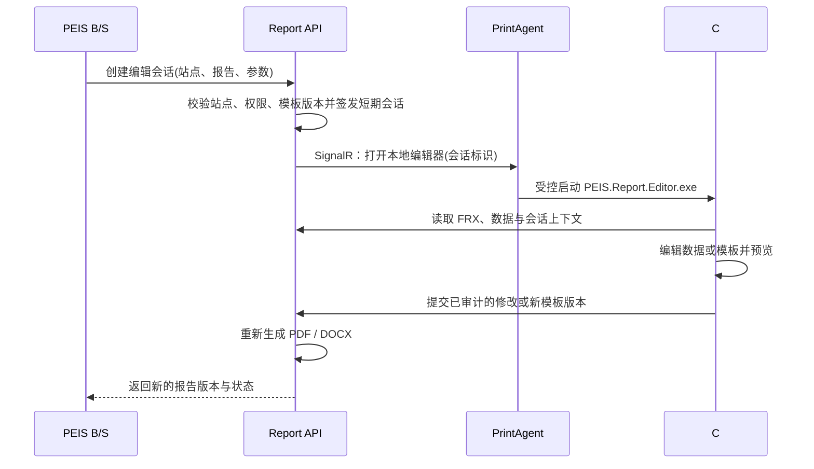

# 打印效率与现场 C# 报告编辑方案

**状态：第一阶段性能优化已实现；现场编辑器待确认编辑范围后实施。**

## 1. 当前打印路径与耗时边界

一次 B/S 打印动作会先在服务端依据业务场景解析所需文档，然后按文档独立生成 PDF、保存临时产物并通过 SignalR 下发至目标工作站。工作站代理下载 PDF 后，按物理打印机分别进入队列，最终调用 Windows 打印后端。

| 阶段 | 当前行为 | 可并发范围 | 现有观测 |
|---|---|---|---|
| 模板、数据与 PDF 渲染 | 不同文档并发渲染，但全局受 `Rendering:MaxConcurrentRenders` 限制，默认值为 2 | 不同 PDF 可并发 | `/internal/diagnostics/rendering` 记录 SQL、准备、导出、缓存等阶段耗时 |
| 产物保存与任务下发 | 文档产物分别保存，再一次下发给同一代理 | 同一业务动作的多文档 | API 返回任务编号并可查询目标状态 |
| 工作站 PDF 下载 | 原来按不同产物串行下载 | 已优化为受控并发下载 | 每个目标仍按原协议报告 `Downloading` 状态 |
| Windows 打印 | 同一物理打印机严格串行；不同物理打印机独立并行 | 不同打印机可并行 | `Queued`、`Printing`、`Completed`、`Failed` 状态 |

> 同一物理打印机保持串行是有意的可靠性约束，而非可消除的性能问题。并行向同一驱动或假脱机程序提交作业，可能导致标签机、针式打印机或共享队列乱序。

## 2. 已实施的效率优化

本次在 `feat/print-performance-and-onsite-editor` 分支新增 `PrintArtifactDownloader`。同一次 B/S 动作中，例如同时生成 A4 报告和条码标签，两个不同的 PDF 现在会并发下载；默认最多同时下载 2 个文件，配置项为 `Agent:MaxConcurrentDownloads`。同一 PDF 被多项打印任务引用时仍只下载一次。

该改造只减少网络传输的可消除等待，不改变以下行为：服务端继续限制 FastReport 渲染并发；每个物理打印机继续单独串行；重试、工作目录缓存和现有 B/S 打印接口均保持不变。新增单元测试覆盖了并发上限、相同产物仅下载一次、同打印机串行与不同打印机并行。

| 现场配置 | 建议值 | 适用说明 |
|---|---:|---|
| `Agent:MaxConcurrentDownloads` | `2` | 推荐默认值；适用于常见 A4 报告 + 条码标签。 |
| `Agent:MaxConcurrentDownloads` | `1` | 工作站网络较弱，或一次只会生成一个 PDF 时使用。 |
| `Agent:MaxConcurrentDownloads` | `3`–`4` | 仅在千兆内网、同次需要多个大 PDF 且验证资源充足后使用。 |
| `Rendering:MaxConcurrentRenders` | `2` | 保持当前保守值；必须依据服务端 CPU、内存与真实模板耗时压测后再提高。 |

目前没有现场物理打印机，因此不能把“打印机开始出纸”的时间缩短量当作已验证结果。服务端已有渲染阶段指标；下一步应在实际站点使用同一批业务数据记录“点击、任务接收、下载完成、开始打印、完成”五个时间点，再分别判断瓶颈是否在 SQL、FRX 渲染、网络、驱动或打印机本体。

## 3. 现场编辑：可以启动 C# 程序，但不能直接编辑 PDF

可以由 B/S 页面请求打开本机 C# 编辑器，但浏览器不应直接通过 URL、ActiveX 或命令行启动 EXE。正确路径是由已受管的 PrintAgent 作为本机桥接程序：B/S 请求指定工作站，服务端确认该工作站在线并创建短期编辑会话，代理收到安全指令后在该 Windows 会话中启动 `PEIS.Report.Editor.exe`。

PDF 是最终呈现结果，并不是可靠的编辑源。若在 PDF 上直接修改文字或图片，会丢失数据绑定、FRX 布局规则、可追溯性和再次生成能力。因此编辑器必须读取**同一份 FRX 模板加结构化报告数据**，在修改后重新渲染 PDF；需要 Word 时再由既有 FRX→DOCX 流程生成近似可编辑 DOCX。

## 4. 必须先确认的编辑范围

现场编辑是不同权限与数据流程，不能默认把它实现为“编辑后覆盖旧报告”。实施前需明确以下三种模式中的一种或多种。

| 编辑模式 | 编辑对象 | 生效范围 | 安全与数据要求 |
|---|---|---|---|
| 单次报告内容更正 | 本次报告的结构化字段、结论、签名等 | 仅当前报告版本 | 需要版本留痕、操作人、原因、原值/新值；不得直接篡改原始 PDF。 |
| FRX 模板维护 | 文本位置、样式、字段、条码等模板元素 | 后续生成的报告 | 管理员权限、模板草稿/审核/发布、版本回滚；FRX 仍是唯一模板来源。 |
| PDF 终稿批注 | 批注、盖章、附件，不改变源数据 | 当前终稿的附加层 | 可以做批注层，但不等同于编辑原报告内容。 |

当前遗留库严格按只读方式接入，因此“单次报告内容更正”不能直接写回遗留业务表。若需要保存编辑结果，应优先建立本平台独立的受控编辑版本库；只有在获得明确书面授权并完成数据字典、审计与回滚设计后，才考虑写入遗留系统。

## 5. 推荐实施顺序

第一步是在真实站点采集端到端时间线并按上述配置验证下载优化。第二步确定现场编辑是“改单次内容”还是“改 FRX 模板”，并确定编辑人员、审核人员和可保存位置。第三步新增短期编辑会话、受控代理启动、C# 编辑器、版本审计和重新生成接口。此过程不会修改 `POST /api/Reports/GetReportByJson` 的遗留兼容接口，也不会让 FastReport 类型泄露到控制器、打印协议或共享契约层。
